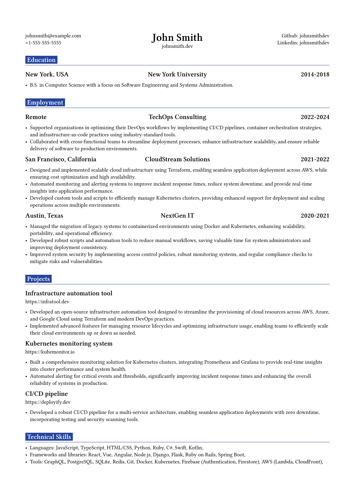

# swe-cv template

A clean and modern Typst template designed for software engineers, featuring well-organized sections for project showcases, technical skills, experience, and education. Optimized for clarity and professionalism.

## Configuration

You can easily customize your personal data by editing the `configuration.yaml` file. This file allows you to set your name, contact information, work experience, education, and skills. Here’s how to do it:

1. Open the `configuration.yaml` file in your text editor.
2. Update the fields with your personal information.
3. Save the file, and your CV will automatically reflect these changes when you compile it.

## License

This project is licensed under the [MIT License](./LICENSE).
